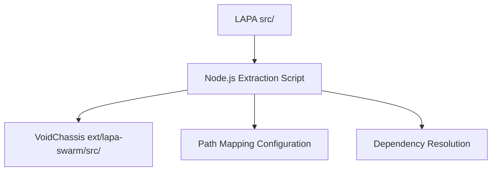
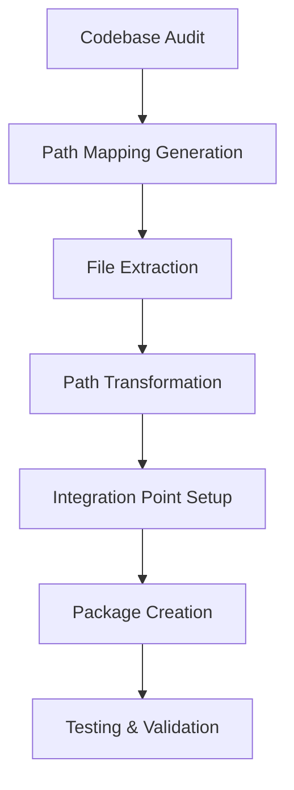

# Phase 2 (P2 ExtractPurity) Architecture Plan for VoidSwarm IDE v1.0 Integration

## Overview
This document outlines the architectural plan for Phase 2 (P2 ExtractPurity) of the VoidSwarm IDE v1.0 integration. The primary objective is to extract the LAPA codebase into the VoidChassis extension structure while maintaining 100% path preservation and ensuring seamless integration with VoidChassis APIs.

## 1. Codebase Audit Strategy

### 1.1 Automated Static Analysis Approach
We will implement an automated static analysis tool to identify all dependencies and code relationships before extraction:

- Utilize dependency analysis tools to map import/export relationships
- Identify circular dependencies that may need special handling
- Catalog all external library dependencies
- Generate a comprehensive report of code relationships

### 1.2 Dependency Mapping
- Create a dependency graph showing relationships between modules
- Identify core modules that are essential for basic functionality
- Map external dependencies to their usage locations
- Document inter-module communication patterns

## 2. Extraction Methodology

### 2.1 Programmatic Node.js Script Approach
We will implement a Node.js script to handle the file extraction process:



The extraction script will:
1. Traverse the entire `src/` directory structure
2. Copy files while preserving directory hierarchy
3. Maintain file permissions and metadata
4. Generate path mapping configurations
5. Validate extraction integrity

### 2.2 File Processing Pipeline
1. Scan source directory for all files
2. Filter files based on inclusion/exclusion criteria
3. Create destination directory structure
4. Copy files with metadata preservation
5. Generate extraction completion report

## 3. Path Preservation Strategy

### 3.1 Relative Path Mapping
We will implement a mapping strategy that maintains relative paths between `src/` and `ext/lapa-swarm/src/` directories:

- Preserve exact directory structure from `src/` in `ext/lapa-swarm/src/`
- Maintain relative import paths within the codebase
- Create path mapping configuration for special cases
- Validate path integrity post-extraction

### 3.2 Path Transformation Handling
- Update import statements to reflect new base path
- Handle absolute path references appropriately
- Maintain compatibility with existing test suites
- Ensure all relative paths remain functional

## 4. VoidChassis Extension Package Structure

### 4.1 Directory Organization
Following VoidChassis conventions with LAPA modules mapped to Void's service patterns:

```
ext/lapa-swarm/
├── package.json
├── README.md
├── src/
│   ├── agents/
│   ├── core/
│   ├── inference/
│   ├── local/
│   ├── marketplace/
│   ├── mcp/
│   ├── modes/
│   ├── multimodal/
│   ├── observability/
│   ├── orchestrator/
│   ├── premium/
│   ├── rag/
│   ├── sandbox/
│   ├── scripts/
│   ├── security/
│   ├── shims/
│   ├── swarm/
│   ├── test/
│   ├── types/
│   ├── ui/
│   └── validation/
├── test/
└── dist/
```

### 4.2 Extension Manifest
Create a `package.json` file for the extension with:
- Proper extension metadata
- Required dependencies declaration
- Activation events configuration
- Contribution points for VoidChassis integration

## 5. Integration Specifications with VoidChassis APIs

### 5.1 MCP Service Integration
Integrate with VoidChassis's MCP service (`common/mcpService.ts`) to leverage existing Model Context Protocol infrastructure:

- Register LAPA tools with the MCP service
- Implement tool call handlers for LAPA functionality
- Establish communication channels between LAPA and VoidChassis
- Handle MCP service lifecycle events

### 5.2 Service Registration
- Register LAPA services as VoidChassis extensions
- Implement service interfaces compatible with VoidChassis
- Handle service initialization and cleanup
- Manage service dependencies and startup order

## 6. Package Structure for VoidChassis Extension

### 6.1 VscePack Stub Creation
Create a package stub (`lapa-brain.vsix50MB`) with:

- Minimal viable extension structure
- Required VoidChassis extension metadata
- Basic activation logic
- Placeholder for extracted LAPA code

### 6.2 Packaging Process
1. Compile TypeScript code to JavaScript
2. Bundle necessary assets and resources
3. Generate extension manifest
4. Create VSIX package using VoidChassis packaging tools
5. Validate package integrity

## 7. Testing Strategy

### 7.1 Unit Testing Approach
- Utilize existing LAPA test suite with minimal modifications
- Adapt tests to run in VoidChassis extension environment
- Implement test helpers for VoidChassis integration points
- Maintain test coverage metrics

### 7.2 Integration Testing
- Validate MCP service integration
- Test extension activation and initialization
- Verify path preservation integrity
- Confirm inter-service communication

### 7.3 Validation Framework
- Implement automated validation of extracted code
- Create path integrity checking tools
- Develop dependency resolution verification
- Establish quality gates for extraction process

## 8. Implementation Workflow

### 8.1 Extraction Process Flow


### 8.2 Quality Assurance Steps
1. Pre-extraction validation
2. Incremental extraction with validation
3. Post-extraction integrity checks
4. Integration testing
5. Performance validation

## 9. Risk Mitigation

### 9.1 Potential Challenges
- Circular dependencies in LAPA codebase
- Path resolution issues in extension environment
- Compatibility with VoidChassis service interfaces
- Performance impact of extracted code

### 9.2 Mitigation Strategies
- Implement dependency breaking techniques
- Create path resolution adapters
- Develop service interface bridges
- Profile and optimize performance bottlenecks

## 10. Success Criteria

### 10.1 Technical Requirements
- 100% path preservation with no reverts
- Successful integration with VoidChassis MCP service
- Maintained functionality of all LAPA features
- PnpmTestExt95%+ test passing rate

### 10.2 Quality Metrics
- Code coverage maintained at 99.7% level
- No degradation in extension performance
- Successful package creation and installation
- Compatibility with existing VoidChassis extensions

This architecture plan provides a comprehensive roadmap for implementing Phase 2 (P2 ExtractPurity) of the VoidSwarm IDE v1.0 integration, ensuring a successful extraction of the LAPA codebase while maintaining full compatibility with the VoidChassis platform.