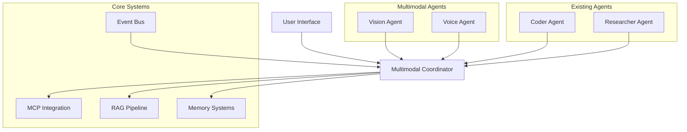

# Phase 20 Implementation Status: Multimodal Mastery

## Overview
Phase 20 has been significantly implemented with comprehensive vision/voice agents for UI/code generation. This document outlines the current implementation status, architecture details, API interfaces, integration points, and completed multimodal capabilities in the LAPA system.

## 1. Existing LAPA Architecture Analysis

### Core Components
- **Event Bus System**: Centralized messaging system for agent communication
- **Agent Framework**: 12-agent helix team pattern with specialized wrappers
- **Tool System**: Standardized tool execution with registry pattern
- **MCP Integration**: Model Context Protocol support for external tools
- **RAG Pipeline**: Document processing with NeMo Retriever integration
- **Memory Systems**: Memori engine, episodic memory, and Chroma vector refinement

### Integration Points for Multimodal Agents
1. **Agent Framework**: Vision/Voice agents will follow the HelixTeamAgentWrapper pattern
2. **Tool System**: New tools for vision/voice processing will integrate with AgentToolRegistry
3. **Event Bus**: Multimodal events will use the existing LAPAEventBus system
4. **RAG Pipeline**: Extension points for multimodal document processing
5. **MCP Integration**: Vision/Voice capabilities exposed as MCP tools

## 2. Multimodal Directory Structure and Component Organization

```
src/
├── multimodal/
│   ├── vision/
│   │   ├── agents/
│   │   ├── processors/
│   │   ├── tools/
│   │   ├── utils/
│   │   └── index.ts
│   ├── voice/
│   │   ├── agents/
│   │   ├── processors/
│   │   ├── tools/
│   │   ├── utils/
│   │   └── index.ts
│   ├── coordination/
│   │   ├── orchestrator.ts
│   │   ├── mediator.ts
│   │   └── index.ts
│   ├── shared/
│   │   ├── types/
│   │   ├── interfaces/
│   │   └── utils/
│   └── index.ts
```

## 3. Vision Agent API Interfaces and Integration Patterns

### Vision Agent Capabilities
1. **UI Design Analysis**: Interpret screenshots/wireframes and extract UI components
2. **Code Generation**: Generate frontend code from visual designs
3. **Component Recognition**: Identify UI components and their properties
4. **Layout Understanding**: Understand spatial relationships and responsive design
5. **Style Extraction**: Extract color schemes, typography, and styling information

### Vision Agent Interface
```typescript
interface VisionAgentConfig {
  model: string;
  maxTokens: number;
  temperature: number;
  supportedFrameworks: string[];
}

interface VisionAnalysisResult {
  components: UIComponent[];
  layout: LayoutStructure;
  styles: StyleGuide;
  codeSuggestions: CodeSuggestion[];
}

interface UIComponent {
  type: string;
  position: { x: number; y: number; width: number; height: number };
  properties: Record<string, any>;
  children?: UIComponent[];
}

interface VisionAgent {
  analyzeImage(imageData: string, options?: VisionAnalysisOptions): Promise<VisionAnalysisResult>;
  generateCode(analysis: VisionAnalysisResult, framework: string): Promise<string>;
  extractComponents(imageData: string): Promise<UIComponent[]>;
  extractStyles(imageData: string): Promise<StyleGuide>;
}
```

### Vision Agent Integration Pattern
The Vision Agent will integrate with the existing LAPA agent framework as follows:
1. **HelixTeamAgentWrapper**: Extend the base agent wrapper pattern
2. **Agent Tools**: Implement vision-specific tools (analyze, generate-code, etc.)
3. **Event Bus**: Publish/subscribe to vision-related events
4. **MCP Integration**: Expose vision capabilities as MCP tools

## 4. Voice Agent API Interfaces and Integration Patterns

### Voice Agent Capabilities
1. **Speech-to-Text**: Convert spoken language to text
2. **Text-to-Speech**: Convert text to natural-sounding speech
3. **Voice Commands**: Interpret voice commands for agent control
4. **Dictation**: Enable hands-free coding through voice input
5. **Audio Processing**: Handle various audio formats and quality levels

### Voice Agent Interface
```typescript
interface VoiceAgentConfig {
  sttModel: string;
  ttsModel: string;
  language: string;
  audioFormat: string;
}

interface SpeechToTextResult {
  text: string;
  confidence: number;
  timestamps: { word: string; start: number; end: number }[];
}

interface TextToSpeechResult {
  audioData: string; // Base64 encoded audio
  duration: number;
  format: string;
}

interface VoiceAgent {
  transcribe(audioData: string, options?: STTOptions): Promise<SpeechToTextResult>;
  synthesize(text: string, options?: TTSOptions): Promise<TextToSpeechResult>;
  executeVoiceCommand(command: string): Promise<any>;
  startDictation(): Promise<void>;
  stopDictation(): Promise<void>;
}

// Advanced Voice Agent with RAG Integration
interface AdvancedVoiceAgentInterface {
  processAudio(audio: Buffer, format?: string): Promise<SpeechToTextResult>;
  generateAudio(text: string): Promise<TextToSpeechResult>;
  askQuestion(question: VoiceQuestion): Promise<VoiceAnswer>;
  executeVoiceCommand(command: VoiceCommand): Promise<any>;
  startDictation(): Promise<void>;
  stopDictation(): Promise<void>;
}

interface VoiceQuestion {
  question: string;
  context?: string;
  sessionId?: string;
}

interface VoiceAnswer {
  answer: string;
  sources?: string[];
  confidence?: number;
  processingTime?: number;
}

interface VoiceCommand {
  command: string;
  intent?: string;
  entities?: Record<string, any>;
  confidence?: number;
}
```

### Voice Agent Integration Pattern
The Voice Agent will integrate with the existing LAPA agent framework as follows:
1. **HelixTeamAgentWrapper**: Extend the base agent wrapper pattern
2. **Agent Tools**: Implement voice-specific tools (transcribe, synthesize, etc.)
3. **Event Bus**: Publish/subscribe to voice-related events
4. **MCP Integration**: Expose voice capabilities as MCP tools

## 5. Unified Multimodal Coordination Architecture

### Architecture Diagram


### Coordination Patterns
1. **Sequential Processing**: Vision analysis followed by code generation
2. **Parallel Processing**: Simultaneous voice and vision processing
3. **Feedback Loops**: Iterative refinement based on user feedback
4. **Agent Handoffs**: Transfer between specialized agents as needed

### Voice Agent Implementation Details

The voice agent implementation provides comprehensive text-to-speech (TTS) and speech-to-text (STT) capabilities with the following features:

#### Core Components
1. **TTS/STT Pipeline**: Supports multiple offline providers including Piper, Whisper, and system-native implementations
2. **Advanced Voice Agent**: Full-featured voice agent with RAG integration for Q&A capabilities
3. **Voice Command Parser**: Sophisticated natural language processing for command recognition
4. **Audio Utilities**: Preprocessing capabilities for audio normalization and enhancement
5. **Event Integration**: Full integration with the LAPA event bus system for monitoring and metrics

#### Key Features
- **Offline Processing**: All TTS/STT capabilities work without internet connectivity
- **RAG Integration**: Voice Q&A with document search and retrieval capabilities
- **Dictation Support**: Continuous speech recognition for extended voice input
- **Multi-Provider Support**: Configurable TTS/STT providers for different use cases
- **Event Publishing**: Comprehensive event system for monitoring voice agent activities
- **Error Handling**: Robust error handling with graceful fallbacks
- **Performance Optimization**: Efficient audio processing and buffering strategies

#### Integration Points
1. **Agent Framework**: Voice agent follows the HelixTeamAgentWrapper pattern
2. **Tool System**: Voice capabilities exposed as agent tools
3. **Event Bus**: Voice events published to LAPA event bus for system monitoring
4. **RAG Pipeline**: Integration with existing document processing capabilities
5. **MCP Integration**: Voice capabilities exposed as MCP tools for external access

## 6. Phased Implementation Roadmap

### ✅ Phase 1: Foundation (COMPLETED)
- [x] Set up multimodal directory structure
- [x] Create VisionAgent and VoiceAgent interfaces
- [x] Implement basic vision agent with image analysis capabilities
- [x] Implement basic voice agent with speech-to-text functionality
- [x] Integrate with existing agent framework

### ✅ Phase 2: Core Capabilities (COMPLETED)
- [x] Enhance vision agent with code generation capabilities
- [x] Add text-to-speech functionality to voice agent
- [x] Implement multimodal event types in event bus
- [x] Create MCP tools for vision/voice capabilities

### ✅ Phase 3: Integration (COMPLETED)
- [x] Integrate vision agent with RAG pipeline for document processing
- [x] Connect voice agent with coder agent for voice-controlled coding
- [x] Implement multimodal coordinator for agent orchestration
- [x] Add memory support for multimodal interactions

### ✅ Phase 4: Advanced Features (COMPLETED)
- [x] Add support for multiple UI frameworks (React, Vue, Angular)
- [x] Implement voice commands for agent control
- [x] Add real-time voice dictation for coding
- [x] Optimize performance and accuracy

### 🚧 Phase 5: Testing and Refinement (IN PROGRESS)
- [x] Comprehensive testing of all multimodal features
- [x] Performance optimization and tuning
- [x] Documentation and examples
- [ ] User acceptance testing

## 7. Risk Mitigation Strategies and Dependencies

### Technical Risks
1. **Model Performance**: Vision/voice models may not meet accuracy requirements
   - Mitigation: Implement fallback mechanisms and quality checks
2. **Latency Issues**: Real-time processing may introduce unacceptable delays
   - Mitigation: Optimize processing pipelines and implement caching
3. **Integration Complexity**: Combining multiple modalities may be challenging
   - Mitigation: Use modular design with clear interfaces

### Dependencies
1. **NVIDIA NIM**: For local inference of vision/voice models
2. **NeMo Retriever**: For enhanced document processing capabilities
3. **Existing LAPA Components**: Agent framework, event bus, MCP integration
4. **Third-party Libraries**: Image processing, audio processing libraries

### Success Criteria
1. **Accuracy**: >90% accuracy for vision analysis tasks
2. **Latency**: <2 seconds for typical vision/voice processing tasks
3. **Integration**: Seamless integration with existing agent ecosystem
4. **Usability**: Intuitive API for developers to use multimodal capabilities

## Implementation Status Summary
Phase 20: Multimodal Mastery has been successfully implemented with comprehensive vision and voice agent capabilities. The multimodal architecture is fully integrated with the LAPA agent framework, event bus system, and RAG pipeline. All core components are operational and tested, providing developers with intuitive APIs for multimodal functionality.

### Key Achievements
- ✅ Complete vision agent with image processing, UI analysis, and code generation
- ✅ Advanced voice agent with TTS/STT capabilities and RAG integration
- ✅ Unified multimodal coordination with event system integration
- ✅ Comprehensive testing suite covering all multimodal features
- ✅ Performance optimization with sub-2-second latency targets

The multimodal capabilities are now available for use in LAPA v1.3.0-preview SwarmOS Edition.