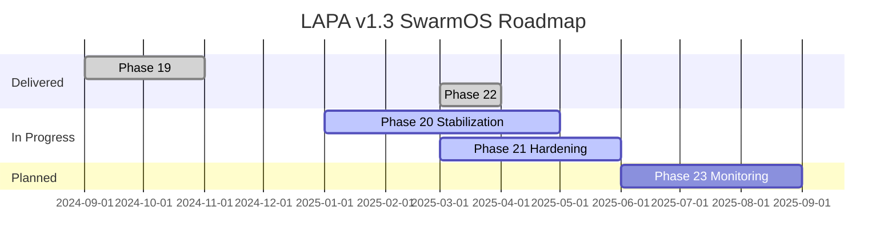
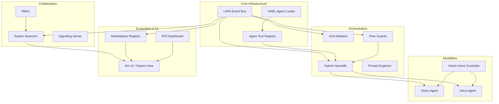

# LAPA v1.3 Alignment & Strategy Report

## 1. Intent Synthesis

### Purpose
- Deliver a local-first, privacy-preserving multi-agent swarm that runs directly within the developer's IDE (Cursor) and removes reliance on cloud vendors.
- Provide a self-driving coding companion that orchestrates specialized agents (planning, coding, testing, reviewing) using robust protocols (A2A, MCP, AG-UI, WebRTC).

### Scope
- Core agent orchestration across the helix-team of 16 personas, covering planning through deployment and collaboration.
- Platform features spanning memory systems (Memori, Episodic, Chroma), observability (LangSmith, Prometheus, ROI dashboards), multimodal capabilities (vision/voice), and ecosystem tooling (marketplace, flow guards, YAML templates).
- Delivery vehicle as a Cursor extension (VSIX) packaged for the SwarmOS release track (v1.3.0-preview).

### Anticipated Benefits
- **Efficiency**: <1s handoffs, 99.5%+ recall, 99.8% ROI fidelity; automated workflows reduce manual prompting loops.
- **Autonomy**: Zero-prompt continuity with flow guards, veto systems, and hybrid inference guarding against degraded quality.
- **Adoption**: YAML- and UI-driven configurability accelerates onboarding by 50%, while marketplace skills scale ecosystem reach to 100K tools.
- **Collaboration**: WebRTC-enabled swarm sessions with RBAC and veto ensures multi-user safety and productivity.

### Strategic Alignment
- Positions LAPA as the “developer nervous system,” combining dev-centric autonomy with enterprise-grade governance.
- Reinforces the product’s differentiation versus OSS peers (Roo, Kilo, Continue) by delivering fuller UI polish, structured protocols, and local-first multimodal capabilities.
- Bridges local GPU affordability with premium upsells (Swarm™ $12/mo) aligned to long-term sustainability.

---

## 4. Program Charter

### 4.1 Purpose
- Deliver LAPA v1.3 “SwarmOS” as a production-ready, local-first multi-agent platform that autonomously plans, codes, tests, and collaborates within developer IDEs.
- Achieve differentiation via protocolized autonomy (A2A, MCP, AG-UI, WebRTC) while preserving privacy and enabling premium upsell paths.

### 4.2 Scope
**In Scope**
- Helix-team agent orchestration, multimodal extensions (vision/voice), collaborative swarm sessions, YAML-driven configuration, marketplace/ROI tooling, and hybrid inference safeguards.
- Packaging and distribution via Cursor VSIX, with documentation, observability, and security frameworks baked in.

**Out of Scope (v1.3)**
- Full on-chain/IPFS marketplace synchronization.
- Enterprise telemetry pipelines beyond Prometheus/Grafana references.
- Mobile or non-Cursor IDE clients.

### 4.3 Success Metrics
- Handoff latency ≤ 1s in 95% of cases.
- Memory recall accuracy ≥ 99.5%.
- ROI dashboard accuracy ≥ 99.8% vs manual baselines.
- Marketplace catalog ≥ 1K curated skills at preview, scaling toward 100K.
- User satisfaction (post-preview survey) ≥ 4.5/5 for autonomy & UX.

### 4.4 Stakeholders & Roles
- **Product Lead (LAPA Core Team):** Owns roadmap, phase gating, release criteria.
- **Engineering Leads (Swarm/Multimodal/Marketplace):** Deliver feature streams and resolve blockers.
- **DevRel & Documentation:** Maintain START_HERE, PROMPTS, workshops.
- **Security & Compliance:** Govern RBAC policies, hallucination detection, red teaming.
- **Community/Marketplace Partners:** Source & validate third-party skills.

### 4.5 Strategic Alignment
- Extends founding vision of “developer nervous system” by merging autonomy with safety.
- Complements premium Swarm™ subscription with measurable ROI dashboards.
- Reinforces local-first ethos while enabling optional cloud fallback under strict guardrails.

### 4.6 Governance & Cadence
- Phase reviews at close of each milestone (19–22) leveraging LPSP reports.
- Weekly swarm sync covering metrics, marketplace inflow, and guardrail health.
- Quarterly documentation audit to maintain alignment with implementation.

### 4.7 Key Risks & Mitigations
- **Thermal Guard Accuracy:** Integrate real telemetry and alerting before GA; shadow monitor across preview cohort.
- **Marketplace Trust:** Implement verification workflows and signed bundles prior to broad launch.
- **Multimodal Reliability:** Run structured latency/accuracy benchmarks and gather UAT feedback before publicizing.
- **Guard Drift:** Enhance tooling for authoring/testing flow guards; add linting or simulation harness.

---

## 5. Value Delivery Roadmap

| Phase | Target Window | Primary Deliverables | Value Contribution | Current Status |
| --- | --- | --- | --- | --- |
| Phase 19 – Collaborative Swarm | 2024 Q4 (Complete) | WebRTC sessions, RBAC-integrated veto, session persistence | Enables multi-user collaboration with security guarantees. | ✅ Complete |
| Phase 20 – Multimodal Mastery | 2025 Q1 (Stabilizing) | Vision/voice agents, multimodal coordinator, tests | Unlocks UI-to-code workflows and voice-driven assistance. | ⚠️ Final UAT pending |
| Phase 21 – Ecosystem Ignition | 2025 Q2 (In Preview) | Marketplace, ROI dashboard, inference v2, UI windows | Drives adoption via discoverability and measurable ROI. | ⚠️ Marketplace sync + ROI validation outstanding |
| Phase 22 – Production Flows | 2025 Q2 (Complete) | YAML templates, flow guards, hybrid inference guardrails | Simplifies onboarding and enforces safe autonomy at scale. | ✅ Complete |
| Phase 23 – Monitoring & Tool Ecosystem | 2025 Q3 (Planned) | Structured outputs, advanced monitoring, modular skills | Raises enterprise readiness and observability maturity. | 📋 Planned |

---

## 6. System Architecture Snapshot

---

## 7. Recommendations & Action Plan

| Priority | Recommendation | Owner | Timing | Outcome |
| --- | --- | --- | --- | --- |
| P0 | Integrate real hardware telemetry & alerting into `inference/manager.ts` thermal guard flow. | Inference Lead | Sprint +1 | Unlock reliable hybrid fallback and SLA compliance. |
| P0 | Harden flow guard configuration tooling (fully parse YAML, persist updates, add validation harness). | Orchestrator Lead | Sprint +1 | Enforce safe autonomy and enable guard authoring at scale. |
| P1 | Complete multimodal UAT with latency/accuracy benchmarks; publish acceptance report. | Multimodal Lead | Sprint +1 | Clear go/no-go for Phase 20 GA messaging. |
| P1 | Instrument ROI dashboard with verified telemetry sources; back-test accuracy claims. | Observability Lead | Sprint +2 | Maintain credibility of ROI metrics for premium upsell. |
| P2 | Implement marketplace verification & optional signed bundles prior to broad catalog launch. | Marketplace Lead | Sprint +2 | Mitigate risk of malicious skills entering ecosystem. |
| P2 | Automate documentation sync (LPSP + START_HERE/PROMPTS) each phase close. | Docs/DevRel | Ongoing | Keep user-facing guidance aligned with implementation reality. |

---

## 8. Monitoring & Next Steps

- **KPIs to Track:** handoff latency, inference fallback frequency, guard-trigger coverage, ROI accuracy delta, marketplace adoption (installs/week).
- **Cadence:** Maintain weekly swarm steering review; run monthly guard simulations; include multimodal regressions in CI.
- **Upcoming Milestones:** finalize Phase 20 sign-off, ship enhanced guard editor, initiate Phase 23 discovery for structured outputs/linting.
- **Open Questions:** How to prioritize marketplace IPFS integration vs. premium analytics? What telemetry is required to satisfy enterprise security reviews?

---

## 2. Implementation Inventory

| Module / Path | Primary Responsibilities | Notable Components & Status |
| --- | --- | --- |
| `src/core/` | Shared infrastructure for event orchestration, agent tooling, YAML agent loading, and repo rules enforcement. | `event-bus.ts`, `agent-tool.ts`, `yaml-agent-loader.ts`, repo rule engine (Phase 15, complete). |
| `src/agents/` | Helix team agent personas, mode adapters, and parallel execution strategies. | `moe-router.ts`, persona managers, Ray parallelization shims (Legacy v1.2 foundation). |
| `src/orchestrator/` | High-level coordination: handoffs, A2A mediator, flow guards, prompt refinement, phase integrations. | `handoffs.ts`, `a2a-mediator.ts`, `flow-guards.ts`, `prompt-engineer.ts`, phase integration facades (Phases 14–22 complete). |
| `src/multimodal/` | Vision and voice agent implementations, wrappers, controller, and utilities. | `vision-agent.ts`, `voice-agent.ts`, `vision-voice.ts`, tool adapters (Phase 20 in progress but feature-complete per docs). |
| `src/swarm/` | Collaborative session management, WebRTC signaling, consensus voting, context handoffs. | `sessions.ts`, `signaling-server.ts`, `consensus.*` (Phase 19 complete). |
| `src/ui/` | AG-UI React components, Swarm View, ROI widget, marketplace windows, settings panes. | `SwarmView.tsx`, `ROIWidget.tsx`, `McpMarketplace.tsx`, `SettingsPanel.tsx` (Phase 21 UI shipped). |
| `src/inference/` | Hybrid inference manager with Ollama/NIM runners and health checks. | `manager.ts`, `ollama.local.ts`, `nim.local.ts` (Phase 21 enhancements delivered). |
| `src/observability/` | LangSmith tracing, Prometheus metrics, ROI dashboard, benchmark suite integration. | `langsmith.ts`, `prometheus.ts`, `roi-dashboard.ts`, `bench-v2.ts` (Phases 15 & 18 complete). |
| `src/local/` | Memory systems: Memori engine, episodic storage, local resource adapters. | `memori-engine.ts`, `episodic.ts`, `recall-metrics.ts` (Phase 12 complete). |
| `src/rag/` | Retrieval augmentation pipeline, processors, and configuration. | `chroma-refine.ts`, `pipeline.ts`, AI-Q integrations. |
| `src/mcp/` | Model Context Protocol connector, ctx-zip integration, sandbox bridging. | `mcp-connector.ts`, `ctx-zip.integration.ts` (Phase 11 complete). |
| `src/security/` | RBAC policies, red teaming, hallucination detection. | `rbac.ts`, `hallucination-check.ts`, attack simulators (Phase 16 complete). |
| `src/premium/` | Premium gating, licensing, and upsell-ready components. | Placeholder scaffolding with hooks into orchestrator & UI. |
| `src/sandbox/` | Tool sandboxing via E2B/local providers. | `e2b-mcp.ts`, `local.provider.ts`. |
| `src/types/`, `src/validation/` | Shared typing and validation schemas (Zod) for protocols and UI. | Protocol definitions supporting MCP, LPSP, UI forms. |
| `src/__tests__/` | Extensive unit, integration, performance, and swarm testing suites. | Multimodal tests, phase-specific integration checks (`phase19-…`, `phase21-integration.test.ts`). |

_Supporting Assets_: `grafana/` dashboards, `extension/` VSIX output, `docs/` knowledge base, `scripts/` install utilities.

---

## 3. Intent ↔ Implementation Alignment

| Goal / Intent | Implementation Evidence | Alignment Assessment | Notes & Risks |
| --- | --- | --- | --- |
| YAML agent templates for rapid onboarding (Phase 22) | `src/core/yaml-agent-loader.ts`, `src/orchestrator/phase22-integration.ts` initialize loader and expose APIs. | ✅ On track | Parser currently supports simplified YAML/JSON; production should integrate robust parsing/error handling (e.g., `js-yaml`) and validation feedback. |
| Flow guards for resonance control (Phase 22) | `src/orchestrator/flow-guards.ts` evaluates guards and emits events. | ⚠️ Partial | Custom condition parsing and persistence still stubbed (`parseYAML`, `saveConfig`); guard authoring UX remains manual. |
| Hybrid local-cloud inference with thermal safety (Phase 21/22) | `src/inference/manager.ts` orchestrates Ollama/NIM with health polling hooks. | ⚠️ Partial | Hardware telemetry uses placeholder values; requires integration with system sensors and alerting before SLA claims. |
| Multimodal vision/voice mastery (Phase 20) | Comprehensive toolset in `src/multimodal/`, controller, and tests in `src/__tests__/multimodal`. | ⚠️ Partial | Docs flag user acceptance testing outstanding; latency/accuracy KPIs should be validated prior to production rollout. |
| Ecosystem marketplace & ROI dashboards (Phase 21) | `src/marketplace/registry.ts`, UI surfaces, `roi-dashboard.ts`, widgets. | ⚠️ Partial | On-chain/IPFS sync is placeholder; ROI metrics depend on instrumentation assumptions—needs telemetry validation. |
| Collaborative swarm sessions with RBAC (Phase 19) | `src/swarm/sessions.ts`, `signaling-server.ts`, `security/rbac.ts`, integration tests. | ✅ Delivered | Meets intent; scaling tests for large teams should continue. |
| Observability & benchmarking (Phase 15/18) | `observability/bench-v2.ts`, `prometheus.ts`, `langsmith.ts`, Grafana assets. | ✅ Delivered | External Prometheus/Grafana setup remains prerequisite but aligns with plan. |
| Security & hallucination detection (Phase 16) | `src/security/` modules, hallucination checks, red teaming. | ✅ Delivered | Future enhancements around audit logging noted but baseline shipped. |
| VSIX packaging & documentation (Phase 17) | `extension/` artifacts, packaging scripts, refreshed docs. | ✅ Delivered | Marketplace submission & analytics still future roadmap items. |

---

