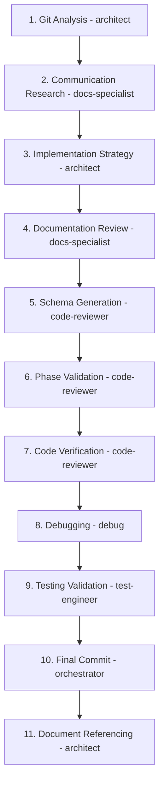

# LAPA God-Level Master Plan: Protocol-Resonant Nexus Workflow

## Executive Summary

This master plan outlines a strategic workflow for the LAPA project that coordinates across multiple specialized modes to accomplish a complex multi-phase validation and improvement process. The plan breaks down an 11-step workflow into logical subtasks with appropriate mode assignments based on each mode's capabilities.

## 11-Step Workflow Breakdown with Mode Assignments

### 1. Git Staging/Commit Analysis with Tool Identification
**Assigned Mode:** `architect`
**Reasoning:** The architect mode is best suited for analyzing repository state and identifying tools used in commits. It has capabilities for system design and planning which are essential for understanding the project's evolution.

### 2. Research Optimal Human+AI Communication Language
**Assigned Mode:** `docs-specialist`
**Reasoning:** The documentation specialist mode is specifically designed for creating clear, comprehensive documentation and understanding communication patterns. This mode excels at analyzing both internal and user-facing communication needs.

### 3. Create Implementation Strategy for Chosen Language
**Assigned Mode:** `architect`
**Reasoning:** The architect mode is responsible for system design and planning optimizations. Creating an implementation strategy aligns with its core capabilities of technology selection and architecture planning.

### 4. Documentation Review and Consolidation
**Assigned Mode:** `docs-specialist`
**Reasoning:** The documentation specialist mode is specifically designed for reviewing, organizing, and consolidating documentation. Its expertise in knowledge retrieval and documentation generation makes it the ideal choice for this task.

### 5. Phase Summary Analysis and Schema Generation
**Assigned Mode:** `code-reviewer`
**Reasoning:** The code reviewer mode specializes in detailed analysis and accuracy checking. Generating schemas from phase summaries requires careful analysis and validation, which aligns with this mode's capabilities.

### 6. Phase Completion Validation Against Project Documents
**Assigned Mode:** `code-reviewer`
**Reasoning:** Validating completion against project documents requires the detailed analysis and accuracy checking capabilities of the code reviewer mode. This mode ensures that all requirements have been properly met.

### 7. Code Implementation Verification
**Assigned Mode:** `code-reviewer`
**Reasoning:** The code reviewer mode is specifically designed for code quality assessment and validation. Its fuzzy rule-based evaluation and system prompt SoC enforcement capabilities make it ideal for verifying code implementations.

### 8. Debugging and Alignment Process
**Assigned Mode:** `debug`
**Reasoning:** The debug mode is specifically designed for troubleshooting and error analysis. Its enhanced bug detection, error analysis, and fix recommendation capabilities make it the optimal choice for debugging and alignment processes.

### 9. Testing Coverage Validation
**Assigned Mode:** `test-engineer`
**Reasoning:** The test engineer mode specializes in comprehensive testing and validation. Its capabilities in test generation, execution, and coverage analysis make it the perfect fit for validating testing coverage.

### 10. Final Git Commit
**Assigned Mode:** `orchestrator`
**Reasoning:** The orchestrator mode is responsible for coordinating workflows and managing task execution. Making the final git commit is a coordination task that requires overseeing the completion of all previous steps, which aligns with the orchestrator's role.

### 11. Phase Creation Document Referencing (START_HERE.md, AGENT.md, LAPA_Master_Plan.toon)
**Assigned Mode:** `architect`
**Reasoning:** The architect mode is responsible for understanding and maintaining the overall project structure and vision. Referencing foundational documents aligns with its system design and planning capabilities.

## Mode Capabilities Summary

| Mode | Core Capabilities |
|------|-------------------|
| `architect` | System design, planning optimizations, technology selection |
| `docs-specialist` | Documentation generation, knowledge retrieval, communication analysis |
| `code-reviewer` | Code analysis, quality assessment, accuracy checking |
| `debug` | Bug detection, error analysis, fix recommendations |
| `test-engineer` | Test generation, execution, coverage analysis |
| `orchestrator` | Workflow coordination, task scheduling, process management |

## Workflow Dependencies

## Implementation Roadmap

### Phase 1: Analysis and Research (Steps 1-4)
- Duration: 2-3 days
- Focus: Understanding current state, researching communication patterns, and planning implementation
- Deliverables: Git analysis report, communication language guidelines, implementation strategy document, consolidated documentation

### Phase 2: Development and Validation (Steps 5-7)
- Duration: 3-4 days
- Focus: Generating schemas, validating phase completion, and verifying code implementations
- Deliverables: Generated schemas, validation reports, code verification summaries

### Phase 3: Quality Assurance (Steps 8-9)
- Duration: 2-3 days
- Focus: Debugging issues and validating testing coverage
- Deliverables: Debugging reports, alignment documentation, testing coverage analysis

### Phase 4: Finalization and Documentation (Steps 10-11)
- Duration: 1 day
- Focus: Coordinating final commit and updating foundational documents
- Deliverables: Final git commit, updated project documentation

## Success Metrics

1. **Repository Health**: Clean git history with properly documented changes
2. **Communication Quality**: Established communication standards adopted across the project
3. **Implementation Completeness**: All planned features implemented according to strategy
4. **Documentation Standards**: Comprehensive, consolidated documentation meeting quality standards
5. **Code Quality**: Verified implementations with minimal bugs
6. **Testing Coverage**: Comprehensive test coverage validation
7. **Process Efficiency**: Smooth coordination between specialized modes

## Risk Mitigation

1. **Mode Switching Failures**: Implement fallback mechanisms using the orchestrator mode to manage transitions
2. **Communication Gaps**: Use the docs-specialist mode to maintain clear documentation of decisions and processes
3. **Quality Issues**: Leverage multiple validation steps through code-reviewer mode to catch issues early
4. **Coordination Challenges**: Utilize the orchestrator mode's workflow coordination capabilities to manage dependencies

This master plan provides a structured approach to executing the 11-step workflow while leveraging the specialized capabilities of each mode in the LAPA system. The plan emphasizes clear responsibilities, dependencies, and success metrics to ensure effective execution of the complex multi-phase validation and improvement process.